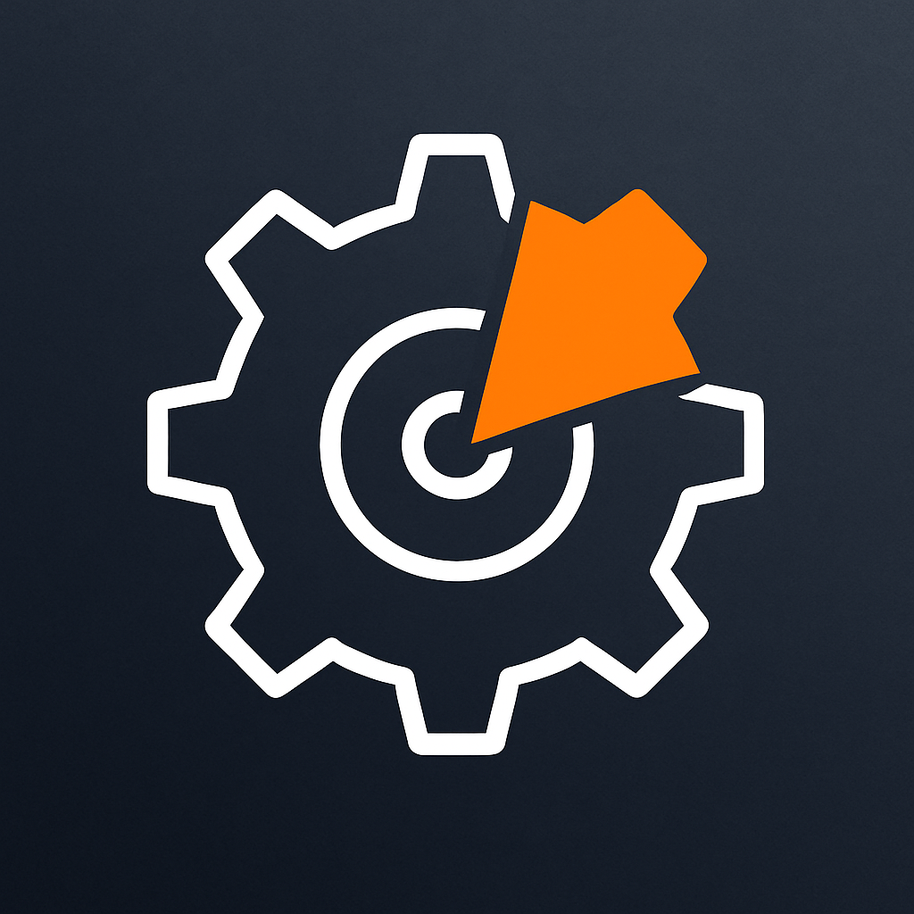

<p align="center">
  
</p>

# BUS Core

[](https://github.com/truegoodcraft/TGC-BUS-Core)
[](LICENSE)


BUS Core is a local-first business core for small and micro shops — free forever, built slowly and deliberately by someone who actually runs a workshop.

I’m building it for my own workshop first: inventory, contacts, and simple manufacturing runs that live on my machine, not in someone else’s cloud. The core will always be free to run locally, with no telemetry, no tracking, and no subscription wall for basic day-to-day work.

This is a long-term side project, not a weekend toy. I expect it to grow slowly, in public, as I use it to run my own shop.

> **Platform note:** Right now the Quickstart targets **Windows + PowerShell**. Other platforms may work but are not officially supported yet.

---

## Status: public alpha

- **Real, but early.** The core works for me; expect rough edges and breaking changes.
- **Side project.** I have a day job and a family. Progress will be steady but not frantic.
- **Free forever.** You can run BUS Core locally, indefinitely, with no license key and no tracking. # If you run it at any point know this. I will do my best to maintain backwards compatibility over all else. No db nukes or wipes, I run this too :p 
- **Pro later, only if you actually need it.** Paid features will be for heavy automation and people who live in this every day. If you don’t need that, you shouldn’t feel any pressure to pay.

### Current surface

**Backend – working alpha**

- Items, vendors, tasks  
- Transactions (money in/out)  
- RFQ generator  
- Manufacturing runs (formerly inventory runs) with journaling  
- Encrypted export/import  

**UI – rough but usable**

- Home dashboard (donuts + last 10)  
- Inventory & contacts screens (vendors + people)  
- Settings (writes toggle, business profile)  

Not yet ready for general non-technical users, but usable for devs and power users who don’t mind rough edges.

---

## Quickstart (dev, Windows PowerShell)

```powershell
git clone https://github.com/truegoodcraft/TGC-BUS-Core.git
cd TGC-BUS-Core
powershell -NoProfile -ExecutionPolicy Bypass -File .\scripts\dev_bootstrap.ps1
# then open http://127.0.0.1:8765/ui/shell.html (the script can auto-open this)


The bootstrap script:

* Sets up the Python environment
* Installs dependencies
* Ensures a default community license at:

```text
%LOCALAPPDATA%\BUSCore\license.json
```

If you want to mint a dev session token from PowerShell:

```powershell
$BASE = "http://127.0.0.1:8765"
$tok = (Invoke-RestMethod -Uri "$BASE/session/token").token
```

(Replace `.token` with the actual property name returned by your `/session/token` endpoint if it differs.)

---

## Who this is for

* Small/micro shops who want to keep **inventory, contacts, and simple manufacturing flows** off the cloud.
* Makers who are comfortable downloading a ZIP, scanning it, and double-clicking a launcher.
* People who prefer **“boring and reliable”** over slick dashboards and surprise SaaS bills.

### Who this is *not* for

* Teams who need a full ERP tomorrow.
* Anyone expecting 24/7 support or guaranteed feature delivery timelines.
* Folks who want a polished SaaS with account creation, billing portal, and all the usual overhead.

---

## Core principles

* Local-first, offline-capable
* No telemetry, no phone-home
* No forced cloud service
* Data is exportable and migratable (no lock-in)
* Clear separation between:

  * **Free core** (AGPL)
  * **Optional PRO plugins** (separate commercial license)
* Most runtime state (license, config, index, etc.) lives under `%LOCALAPPDATA%\BUSCore\...` so you can wipe the repo directory without losing that state. The main DB still lives in the repo directory today and will be moved into AppData as part of a future cutover.

---

## Dev & smoke (for contributors)

> If you just want to run BUS Core, use the **Quickstart** above.
> This section is for people hacking on the code and running smoke tests.

Development and smoke testing use the **canonical dev launcher + smoke harness**, with the `uvicorn` commands shown below as a manual equivalent. `launcher.py` is not used for the dev flow.

### Two-window dev flow

**Window A (server):**

```powershell
# 1) Go to the project folder
cd "C:\path\to\TGC-BUS-Core"

# 2) Install deps (uses your global Python)
python -m pip install -r requirements.txt

# 3) Make sure the app can import the repo modules
$env:PYTHONPATH = (Get-Location).Path

# 4) Guarantee a default license for dev
$lic = Join-Path $env:LOCALAPPDATA 'BUSCore\license.json'
if (!(Test-Path $lic)) {
  New-Item -ItemType Directory -Force -Path (Split-Path $lic) | Out-Null
  '{"tier":"community","features":{},"plugins":{}}' | Set-Content -Path $lic
}

# 5) Point UI path if your app expects it
$env:BUS_UI_DIR = (Join-Path (Get-Location) 'core\ui')

# 6) Run the server
python -m uvicorn core.api.http:create_app --host 127.0.0.1 --port 8765 --reload
```

**Window B (smoke):**

```powershell
# 1) Go to the project folder
cd "C:\path\to\TGC-BUS-Core"

# 2) Wait for the server to be up
$u = 'http://127.0.0.1:8765/session/token'
$max = 30
for ($i=0; $i -lt $max; $i++) {
  try { Invoke-WebRequest -UseBasicParsing $u -TimeoutSec 2 | Out-Null; break } catch { Start-Sleep -Seconds 1 }
}

# 3) Run smoke
powershell -NoProfile -ExecutionPolicy Bypass -File ".\buscore-smoke.ps1"
```

### Smoke expectations

`buscore-smoke.ps1` is the canonical smoke harness. Smoke must be **100% green** for a change to be accepted.

* Public `GET /health` returns `{"ok": true}` (200).
* Protected `GET /health` (with `X-Session-Token`) returns 200 with `version`, `policy`, `license`, and `run-id`.
* `GET /ui/shell.html` returns HTTP 200 with content.

---

## Project structure (high level)

* `core/` – backend application (FastAPI, domain logic, RFQ, inventory, export/import, etc.)
* `core/ui/` – front-end (HTML/JS/CSS, cards, dashboard)
* `launcher/` – helper scripts / launchers
* `docs/`

  * `SOT.md` – Source of Truth (design, rules, constraints)
  * `ARCHITECTURE.md` – architecture overview
  * `ROADMAP.md` – versioned roadmap and scope

*(If these docs don’t exist yet, they will; for now, the README and code are the best reference.)*

---

## Contributions, feedback, and pace

BUS Core is open for people to look at, fork, and contribute to — but it is still **my workshop’s core tool first**.

If you want to help:

* **Brutal honesty is welcome.** If something is confusing, slow, or dumb, say so plainly.
* **Pull requests are welcome.** Especially small, focused fixes and docs improvements.
* **No entitlement.** I don’t owe anyone features or timelines. I’ll merge what fits the project and my own use first.

If this project genuinely helps you run your shop, that’s butter on top. If it ever earns enough to justify hiring help (contractors, docs, etc.), great. Until then, it will sink or float on its own merit — no hype, no pressure.

---

## Monetization philosophy

The core of BUS Core will always be free to run locally with no tracking and no required online account.

If I ever charge money, it will be for **Pro automation and “power user” features** — the kind of things you only need once BUS Core is already in the middle of your daily work. If you never reach that point, you should never feel pushed to pay.

I don’t even plan to run Pro for myself until I actually need it. When I do, I’ll pay for it like everyone else.

---

## Why I’m doing this

I got tired of running my life and my workshop through a pile of web dashboards and subscriptions that all assume I’m a SaaS customer first and a human second.

BUS Core exists for a simpler reason: I want a **local business core** I can trust to outlive any one tool, laptop, or trend — something I can install, point at a database in my own AppData, and keep using even if the original repo disappears.

This is a side project, but it is not a throwaway project. My wife and kids see the hours going into this. That matters to me. If I’m spending family time on it, it has to be something I’m willing to run my own shop on for years — not just a pretty demo.

I’m building BUS Core for my own workflow first. You are welcome to come along for the ride:

* The **core will always be free** to run locally, with no tracking and no forced upgrade paths.
* If monetization shows up, it will be in the form of **optional Pro automation** for people who already rely on BUS Core daily and want it to go further.
* This project will **sink or float on its own merit**. I’m not pumping a roadmap, chasing hype, or pretending this is a funded startup.

If BUS Core ends up helping enough people that it can fund its own growth — contractors, better docs, maybe even a full-time focus one day — great. If not, it will still have done its job: giving me (and maybe a few other stubborn small shops) a business core that lives where it belongs — on our own machines.

---

## License

The core of this project is licensed under the **GNU Affero General Public License v3.0**.

See the `LICENSE` file for full details.

Optional PRO plugins and commercial add-ons may be offered under a separate license by True Good Craft.


Anything I didn’t touch is either **Correct according to SoT** or safely **Not specified in SoT**.

### Data location (Windows)
By default BUS Core stores its SQLite DB at:


%LOCALAPPDATA%\BUSCore\app\app.db

You can override the root via:


setx BUSCORE_HOME D:\\BUSCoreData

The server logs and `/dev/db/where` return the exact path and the driver-reported file via `PRAGMA database_list`.
### Python version
BUS Core currently supports **Python 3.11–3.13**. Python 3.14 is not yet supported due to upstream framework changes in async lifespan handling. Use 3.11 or 3.12 for best stability.
